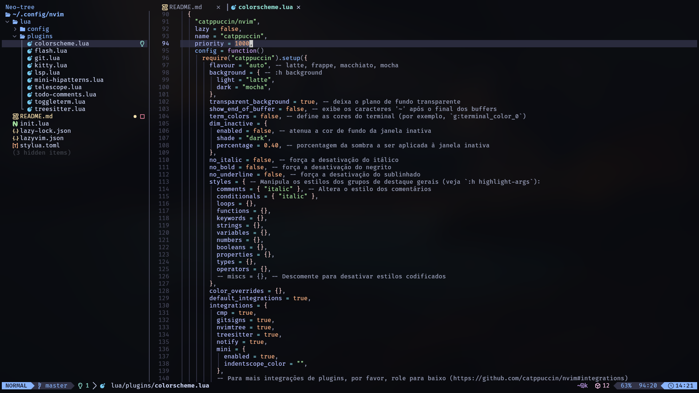

# Minhas Configurações do Neovim

Este repositório contém as minhas configurações personalizadas do **Neovim**,
utilizando o **LazyVim** como base, além de uma seleção de plugins que melhoram
a produtividade no ambiente de desenvolvimento.



## Instalação

1. Clone o repositório:
   ```bash
   git clone https://github.com/MatheusWesley/nvim.git
   ```

## LazyVim

- [LazyVim](https://github.com/LazyVim/LazyVim).
  - [documentation](https://lazyvim.github.io/installation)

## Plugins Utilizados

Abaixo estão os principais plugins que utilizo no Neovim:

- **[Telescope](https://github.com/nvim-telescope/telescope.nvim)**: Um poderoso buscador e filtro de arquivos.
- **[Treesitter](https://github.com/nvim-treesitter/nvim-treesitter)**: Fornece realce de sintaxe avançado e análises sintáticas.
- **[Mini Hipatterns](https://github.com/echasnovski/mini.nvim)**: Um conjunto de funções úteis para manipulação de padrões no código.
- **[LSP (Language Server Protocol)](https://github.com/neovim/nvim-lspconfig)**: Fornece funcionalidades como autocompletar, linting e formatação de código.

## Tema: Catppuccin Mocha

Algums alterações no tema são para transparencia do plano de fundo pois utilizo o hyprland e fica bonito usar desta forma, a habilitar as notificações para seguir o tema.

```lua
require("catppuccin").setup({
    transparent_background = true,
    flavor = "mocha",
      integrations = {
        cmp = true,
        gitsigns = true,
        nvimtree = true,
        treesitter = true,
        notify = true,
        mini = {
            enabled = true,
            indentscope_color = "", -- Personalização do plugin mini-hipatterns
        },
    },
})
```

## Finalizando

Até o momento essas são as configurações que uso em meu nvim no terminal kitty, pode ser que mude algumas coisas lá e cá, mas esse é o core. Façam bom uso.
